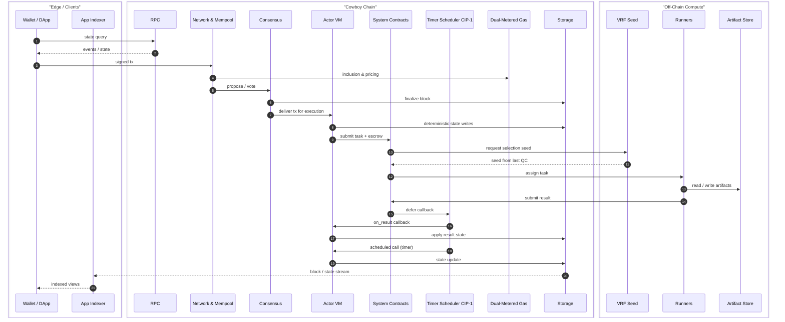

## System Architecture

```mermaid
sequenceDiagram
    autonumber

    %% ================== LANE: EDGE ==================
    box "Edge / Clients"
      participant U as Wallet / DApp
      participant IDX as App Indexer
    end

    %% ================== LANE: COWBOY CHAIN ==================
    box "Cowboy Chain"
      participant RPC as RPC
      participant NET as Network & Mempool
      participant CONS as Consensus
      participant ACT as Actor VM
      participant SYS as System Contracts
      participant SCH as Timer Scheduler CIP-1
      participant FEE as Dual-Metered Gas
      participant STO as Storage
    end

    %% ================== LANE: OFF-CHAIN ==================
    box "Off-Chain Compute"
      participant VRF as VRF Seed
      participant RUN as Runners
      participant BLOB as Artifact Store
    end

    %% ================== MAIN FLOW ==================
    U ->> RPC: state query
    RPC -->> U: events / state

    U ->> NET: signed tx
    NET ->> FEE: inclusion & pricing
    NET ->> CONS: propose / vote
    CONS ->> STO: finalize block

    CONS ->> ACT: deliver tx for execution
    ACT ->> STO: deterministic state writes

    %% ---- Off-chain task path (CIP-2, summarized) ----
    ACT ->> SYS: submit task + escrow
    SYS ->> VRF: request selection seed
    VRF -->> SYS: seed from last QC
    SYS ->> RUN: assign task
    RUN ->> BLOB: read / write artifacts
    RUN ->> SYS: submit result
    SYS ->> SCH: defer callback
    SCH ->> ACT: on_result callback
    ACT ->> STO: apply result state

    %% ---- Scheduled / timed path (CIP-1, summarized) ----
    SCH ->> ACT: scheduled call (timer)
    ACT ->> STO: state update

    %% ---- Observability back to edge ----
    STO -->> IDX: block / state stream
    IDX -->> U: indexed views

```
